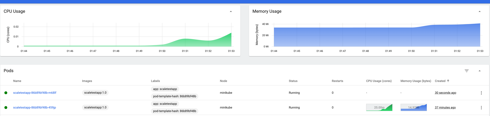
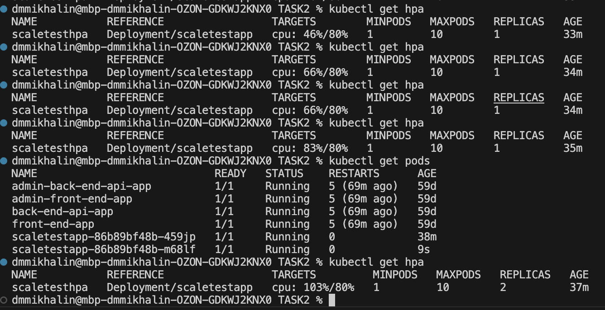
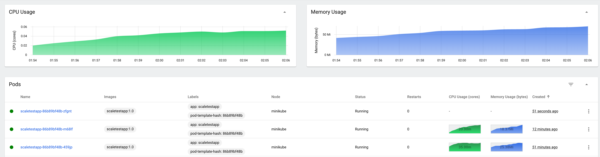
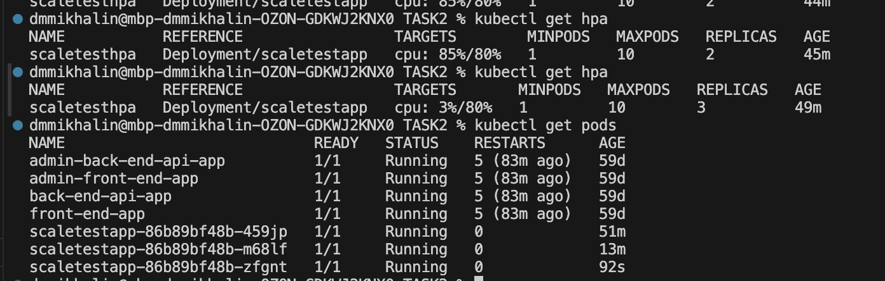
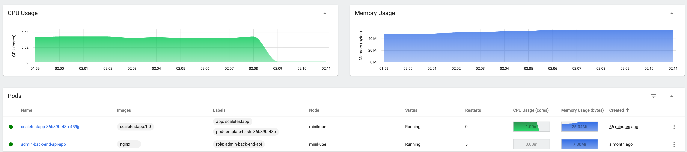
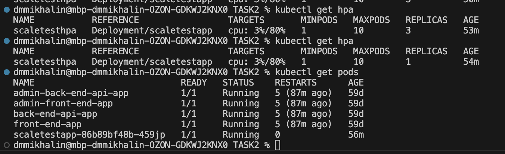

В данном решение было реализовано hpa по cpu вместо memory. Утилизация CPU при увеличении нагрузки растет быстрее, поэтому был выбран этот вариант

Начальное состояние:

Добавление второй реплики под нагрузкой:

Добавление третье реплики под нагрузкой:

Удаление реплик и возврат к одной при отсутствии нагрузки:

